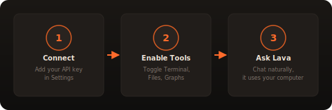
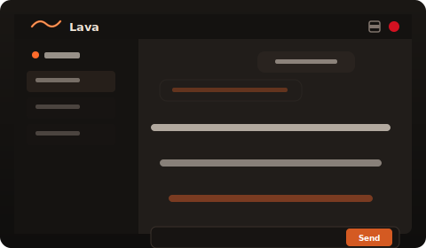
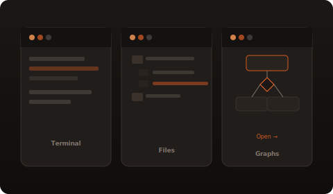
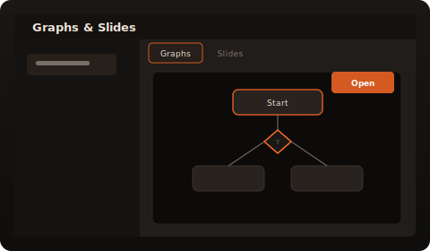
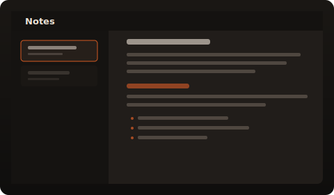
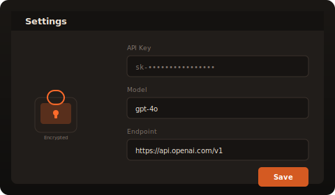

  
  <h1>Lava</h1>
  
Your local AI coworker. Private, powerful, and running on your machine.

---

## What is Lava?

Lava is a desktop AI assistant that runs entirely on your computer. It connects to any OpenAI-compatible API (OpenAI, Groq, Together, local models via Ollama) and gives the AI real tools to work with — a terminal, file system access, graph generation, and more. Your API key never leaves your machine, and your conversations stay on your disk.

---

## Why Lava?

| | Lava | Web Chatbots |
|---|---|---|
| **Privacy** | Everything stays on your computer | Data sent to remote servers |
| **File Access** | Read, write, and organize your local files | Upload/download only |
| **Terminal** | Run shell commands directly | No terminal access |
| **Graphs** | Generate and explore diagrams in a full window | Static images at best |
| **Notes** | AI saves key info to persistent notes | Notes lost when chat closes |
| **No Account** | Add your API key and go | Signup, billing, cookies |
| **Speed** | Direct API calls, no middleware | Routed through their servers |

---

## Getting Started

1. **Connect** — Open Settings, paste your OpenAI-compatible API key and endpoint. Your key is encrypted at rest with AES-256-GCM.
2. **Enable Tools** — Toggle Terminal, Files, Browser, Graphs, and Slides in the sidebar. The AI only uses tools you've turned on.
3. **Ask Lava** — Chat naturally. Lava reads your files, runs commands, generates diagrams, and saves notes — all on your machine.

---

## Features

### Chat

Talk to Lava like a teammate. Ask questions, give tasks, paste errors. Lava streams responses in real time with a typing indicator, and auto-scrolls as content arrives. When Lava runs a tool, you see a live status bar showing which tool is executing.

### Terminal & Files

Lava can run shell commands on your machine and read, write, create, and move files — but only inside the workspace directory you choose. All tool use requires the tool to be explicitly enabled in the sidebar.

### Graphs & Diagrams

Ask Lava for a flowchart, sequence diagram, class diagram, or any Mermaid-compatible visualization. Graphs are saved per session and organized in the Graphs tab. Click **Open** to launch any graph in its own browser window with full zoom and pan controls — so even the largest diagrams are easy to read and explore.

### Notes

Lava automatically saves important information — credentials, decisions, IPs, key facts — to persistent notes so you can refer back to them later. Notes are organized by session with full Markdown rendering.

### Settings

Configure your AI provider, model, and endpoint. Your API key is encrypted at rest using AES-256-GCM — it's never sent anywhere except directly to the API endpoint you configure. Workspace selection lets you scope file and terminal access to a specific directory.

---

## Security & Privacy

- **Encrypted at rest** — API keys are stored in a local SQLite database encrypted with AES-256-GCM
- **No telemetry** — Lava doesn't phone home, ever. Zero analytics, zero tracking
- **Local data** — All sessions, notes, artifacts, and messages live in your app data directory as files you control
- **Atomic writes** — Data files are written atomically (temp + rename) so a crash can't corrupt your conversations
- **Path validation** — Session IDs are validated to prevent path traversal attacks
- **Output limits** — Shell commands are capped at 1 MB to prevent memory issues
- **Message windowing** — Only the last 50 messages are sent to the API to stay within token limits

---

## System Requirements

- **Windows 10/11** (x64)
- **OpenAI-compatible API** — works with OpenAI, Groq, Together AI, Ollama, and any compatible endpoint
- **Internet connection** — needed to reach your chosen API endpoint (unless using a local model via Ollama)

---

  
  
<strong>Built with ❤ by lava team</strong>

